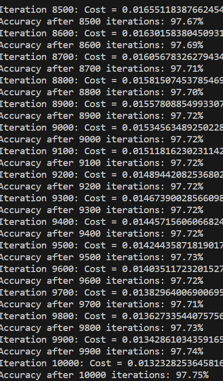
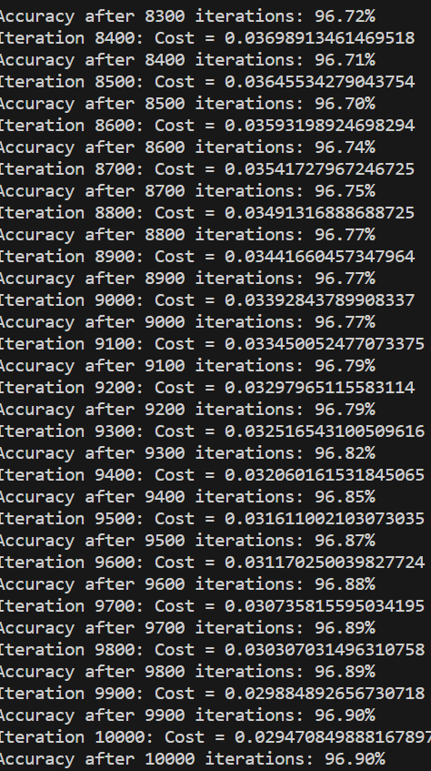

# Kavi's FINAL Results

## Base Model (sigmoid):
- 93.55% accuracy
- 0.15 learning rate
- 4500 iterations
## ReLu Model (1 hidden layer): 
- 97.75% accuracy 
- 0.15 learning rate
- 10000 iterations

## ReLu Model (2 hidden layers): 
- 96.90% accuracy 
- 0.05 learning rate
- 10000 iterations

## Reflection
The results from the single hidden layer and double hidden layer are very comprable especially since one is faster to train. The double layer would probably outperform the single layer if the layer sizes were tuned more and if the learning rate was tuned. I noticed that fore the learning rate, 0.1 gave good initial results but not good final results. Also, if the LR was 0.01, the accuracy was just stuck at 11.35%

